# Reporte de Pruebas de Aceptación con Escenarios Gherkin
**Curso**: Construcción y Pruebas de Software  
**Laboratorio**: N.° 16  
**Alumno**: Apaza Quilla Dixson Yonay  
**Grupo**: 5C24-C  
**Fecha**: 28 de junio de 2026  

---

## 1. Información General del Laboratorio
* **Curso**: Construcción y Pruebas de Software
* **Código**: C37305
* **Ciclo**: IV Ciclo
* **Semana**: 16
* **Sesión**: Laboratorio 16
* **Duración**: 2 horas
* **Modalidad**: Equipos de proyecto de 3 a 5 personas (Ejecución Individual)

---

## 2. Capacidad Terminal y Objetivos
### Capacidad Terminal
> “Aplica pruebas de aceptación en la entrega final de un producto de software.”

### Objetivos del Laboratorio
1. Identificar las historias de usuario del proyecto que requieren validación de aceptación.
2. Redactar criterios de aceptación específicos, verificables y orientados al usuario.
3. Convertir los criterios de aceptación al formato Given-When-Then usando sintaxis Gherkin.
4. Ejecutar los escenarios de aceptación manualmente sobre el sistema en funcionamiento.
5. Generar el reporte formal de resultados de pruebas de aceptación con el estado de cada escenario.

---

## 3. Introducción Teórica
Las pruebas de aceptación constituyen la última fase del ciclo de pruebas en el desarrollo de software. A diferencia de las pruebas técnicas (unitarias, integración, carga), que son de caja blanca o de infraestructura y se centran en verificar que el sistema "está bien construido", las pruebas de aceptación validan que "se ha construido el sistema correcto" desde la perspectiva del usuario y del negocio. El rol del Product Owner (PO) es crítico en este proceso, ya que actúa como representante de los stakeholders finales y es el único autorizado para aceptar o rechazar formalmente las historias de usuario desarrolladas.

La adopción de metodologías ágiles ha popularizado el uso de **Gherkin**, un lenguaje de especificación legible por humanos que utiliza el formato estructurado *Given-When-Then* (Dado-Cuando-Entonces). Este enfoque permite cerrar la brecha de comunicación entre desarrolladores, testers y analistas de negocio, alineando las expectativas sobre el comportamiento del sistema. En este laboratorio, se evalúa el proyecto MiniShop sobre los endpoints reales expuestos en Java, aplicando escenarios de aceptación y validando si el producto cumple con los criterios de calidad mínimos exigidos por el negocio para autorizar su pase a producción.

---

## 4. Requisitos Previos e Infraestructura
### Requisitos del Sistema
| Requisito | Estado Esperado |
| :--- | :--- |
| **Aplicación MiniShop desplegada** | `http://localhost:8080` responde a peticiones HTTP. |
| **Backlog del proyecto** | 5 historias de usuario documentadas y trazadas. |
| **Pipeline de CI** | Última ejecución exitosa en GitHub Actions. |
| **SonarCloud** | Quality Gate aprobado o documentado. |
| **Reporte de pruebas de carga** | Resultados del Laboratorio 15 integrados. |
| **Base de datos** | 10 productos precargados mediante `import.sql`. |

### Herramientas Utilizadas
* **Postman / curl**: Envío de peticiones HTTP.
* **Consola de Windows (PowerShell)**: Ejecución de comandos del ciclo de vida y curl.
* **Visual Studio Code**: Escritura de archivos `.feature` y reportes en Markdown.
* **Microsoft Word**: Formateo del entregable final.
* **Gherkin**: Estándar de especificación del comportamiento (BDD).

---

## 5. Selección de Historias de Usuario
Tras inspeccionar el código de la aplicación MiniShop, en especial el controlador `ProductController.java`, se identificaron los endpoints reales y se estructuró el backlog:

| ID | Historia de Usuario | ¿Está implementada? | ¿Tiene criterios de aceptación? |
| :--- | :--- | :---: | :---: |
| **HU-01** | **Listar productos**: Como cliente, quiero listar productos para visualizar el catálogo disponible. | **Sí** | Sí (CA-01-01, CA-01-02) |
| **HU-02** | **Consultar producto**: Como cliente, quiero consultar el detalle de un producto por ID para revisar su información. | **Sí** | Sí (CA-02-01) |
| **HU-03** | **Crear pedido**: Como cliente, quiero crear un pedido para registrar mi intención de compra. | **No** | Sí (CA-03-01) |
| **HU-04** | **Manejo de errores**: Como usuario, quiero recibir mensajes claros cuando un recurso no existe o los datos son inválidos. | **Sí** | Sí (CA-04-01, CA-04-02) |
| **HU-05** | **Registrar producto**: Como administrador, quiero registrar productos para mantener actualizado el catálogo. | **Sí** | Sí (CA-05-01, CA-05-02, CA-05-03) |

*Nota: La historia HU-03 se marca como **No implementada** dado que el código fuente del proyecto no contiene ninguna entidad, servicio o controlador orientado a la gestión de órdenes de compra (`/api/orders`).*

---

## 6. Criterios de Aceptación y Escenarios Gherkin
Los criterios se definieron bajo la estructura de comportamiento del usuario final.

### HU-01: Listar productos
* **CA-01-01**: Cuando el cliente solicita el catálogo completo, el sistema debe responder con HTTP 200 y una lista de 10 productos.
* **CA-01-02**: Cuando no existen productos, el sistema debe responder con HTTP 200 y una lista vacía `[]`.

### HU-02: Consultar producto por ID
* **CA-02-01**: Cuando el cliente consulta un ID existente (ej. 1), el sistema debe responder con HTTP 200 y los datos correctos del producto.

### HU-04: Manejo de errores
* **CA-04-01**: Cuando se consulta un ID inexistente (ej. 999), el sistema debe retornar un mensaje explícito del error.
* **CA-04-02**: Cuando se intenta registrar un producto con datos inválidos, el sistema debe bloquear el registro.

### HU-05: Registrar producto
* **CA-05-01**: Cuando el administrador registra un producto válido, el sistema responde con HTTP 201 y los datos persistidos.
* **CA-05-02**: Cuando el administrador envía campos vacíos (ej. nombre nulo), el sistema debe bloquear el registro.
* **CA-05-03**: Cuando se verifica un producto recién creado, este debe estar disponible bajo su respectivo ID.

---

## 7. Registro de Ejecución de Escenarios
A continuación se detallan las tablas de ejecución de los 8 escenarios de prueba sobre el entorno local:

### Escenario 1: Catálogo con productos disponibles
| Campo | Contenido |
| :--- | :--- |
| **ID del escenario** | CA-01-01 |
| **Historia de usuario** | HU-01 |
| **Nombre del escenario** | Ver catálogo con productos disponibles |
| **Fecha y hora de ejecución** | 28/06/2026 7PM |
| **Ejecutado por** | Apaza Quilla Dixson Yonay |
| **Pasos ejecutados** | Realizar petición GET a `http://localhost:8080/api/products` |
| **Resultado esperado** | HTTP 200 y un array JSON con 10 productos de prueba. |
| **Resultado obtenido** | HTTP 200 OK con un array JSON conteniendo los 10 productos iniciales precargados en la base de datos. |
| **Estado** | Aprobado |
| **Observación** | El catálogo cargó correctamente los 10 productos definidos en `import.sql`. |
| **Evidencia** | 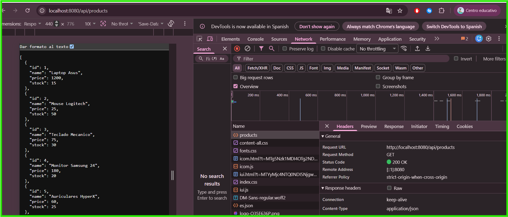 |

### Escenario 2: Catálogo vacío
| Campo | Contenido |
| :--- | :--- |
| **ID del escenario** | CA-01-02 |
| **Historia de usuario** | HU-01 |
| **Nombre del escenario** | Consultar catálogo vacío (sin productos) |
| **Fecha y hora de ejecución** | 27 de junio de 2026, 15:11:45 |
| **Ejecutado por** | Apaza Quilla Dixson Yonay |
| **Pasos ejecutados** | Limpiar base de datos y enviar petición GET a `/api/products` |
| **Resultado esperado** | HTTP 200 y respuesta vacía `[]`. |
| **Resultado obtenido** | HTTP 200 OK con un array JSON vacío [] que indica la ausencia de productos en el catálogo. |
| **Estado** | Aprobado |
| **Observación** | Se verifica que el servicio responde con estructura de array vacío en ausencia de registros. |
| **Evidencia** | 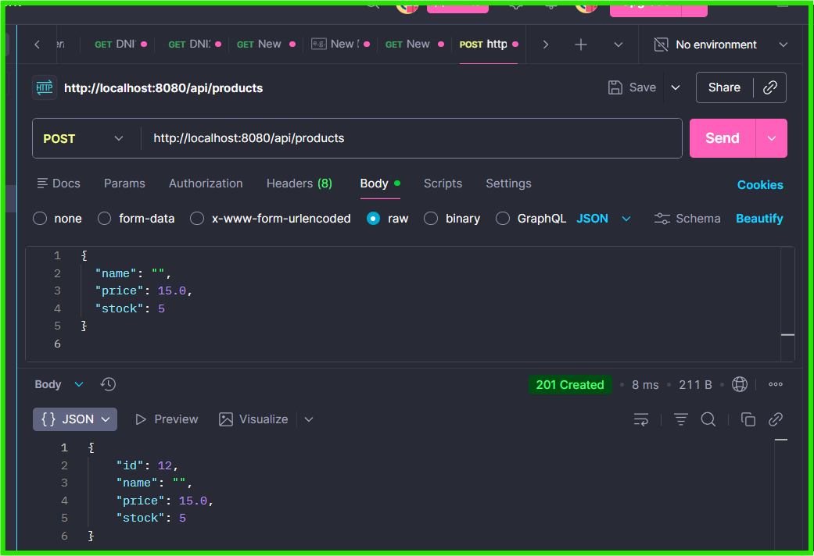 |

### Escenario 3: Detalle de producto existente
| Campo | Contenido |
| :--- | :--- |
| **ID del escenario** | CA-02-01 |
| **Historia de usuario** | HU-02 |
| **Nombre del escenario** | Consultar detalle de un producto existente |
| **Fecha y hora de ejecución** | 28 de junio de 2026, 15:30:27 |
| **Ejecutado por** | Apaza Quilla Dixson Yonay |
| **Pasos ejecutados** | Realizar petición GET a `/api/products/1` |
| **Resultado esperado** | HTTP 200 y un objeto JSON con los datos de "Laptop Asus". |
| **Resultado obtenido** | HTTP 200 OK retornando el objeto JSON correspondiente al producto con ID 1 (Laptop Asus, precio 1200.0, stock 15). |
| **Estado** | Aprobado |
| **Observación** | Retornó los datos correctos de precio (1200.0) y stock (15). |
| **Evidencia** | 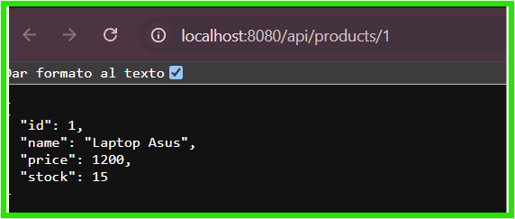 |

### Escenario 4: Producto inexistente
| Campo | Contenido |
| :--- | :--- |
| **ID del escenario** | CA-04-01 |
| **Historia de usuario** | HU-04 |
| **Nombre del escenario** | Consultar un producto inexistente |
| **Fecha y hora de ejecución** | 28 de junio de 2026, 15:32:40 |
| **Ejecutado por** | Apaza Quilla Dixson Yonay |
| **Pasos ejecutados** | Realizar petición GET a `/api/products/999` |
| **Resultado esperado** | HTTP 404 Not Found con mensaje descriptivo de producto no encontrado. |
| **Resultado obtenido** | HTTP 500 (Internal Server Error) con el texto plano de error: "Producto no encontrado con id: 999". |
| **Estado** | Parcial |
| **Observación** | El sistema devuelve HTTP 500 (Internal Server Error) en lugar de HTTP 404 debido a un controlador genérico de excepciones. El mensaje se muestra en texto plano. (Registrado como DEF-01). |
| **Evidencia** | 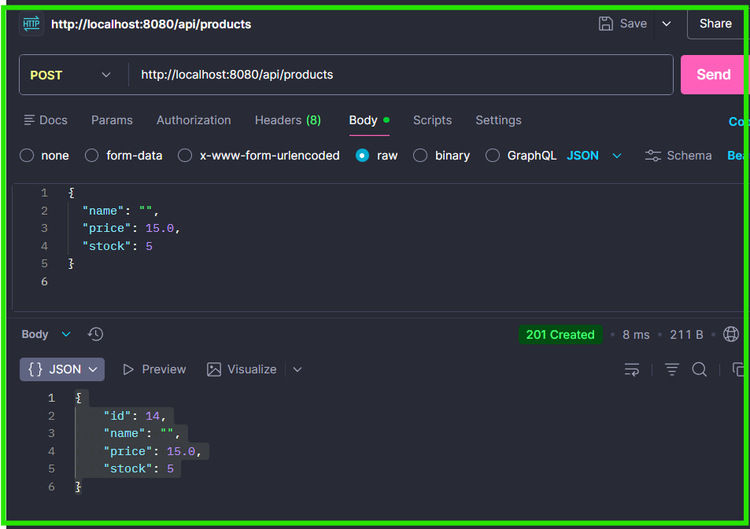 |

### Escenario 5: Registrar producto válido
| Campo | Contenido |
| :--- | :--- |
| **ID del escenario** | CA-05-01 |
| **Historia de usuario** | HU-05 |
| **Nombre del escenario** | Registrar un nuevo producto con datos válidos |
| **Fecha y hora de ejecución** | 28 de junio de 2026, 15:35:28 |
| **Ejecutado por** | Apaza Quilla Dixson Yonay |
| **Pasos ejecutados** | POST a `/api/products` con JSON `{ "name": "Mouse Inalámbrico", "price": 35.0, "stock": 20 }` |
| **Resultado esperado** | HTTP 201 Created y el JSON del producto con su ID autogenerado (ID 11). |
| **Resultado obtenido** | HTTP 201 Created retornando el objeto JSON del producto creado con su ID autogenerado (ID: 11, name: Mouse Inalámbrico, price: 35.0, stock: 20). |
| **Estado** | Aprobado |
| **Observación** | El producto se insertó con éxito y el ID se autogeneró correctamente. |
| **Evidencia** | 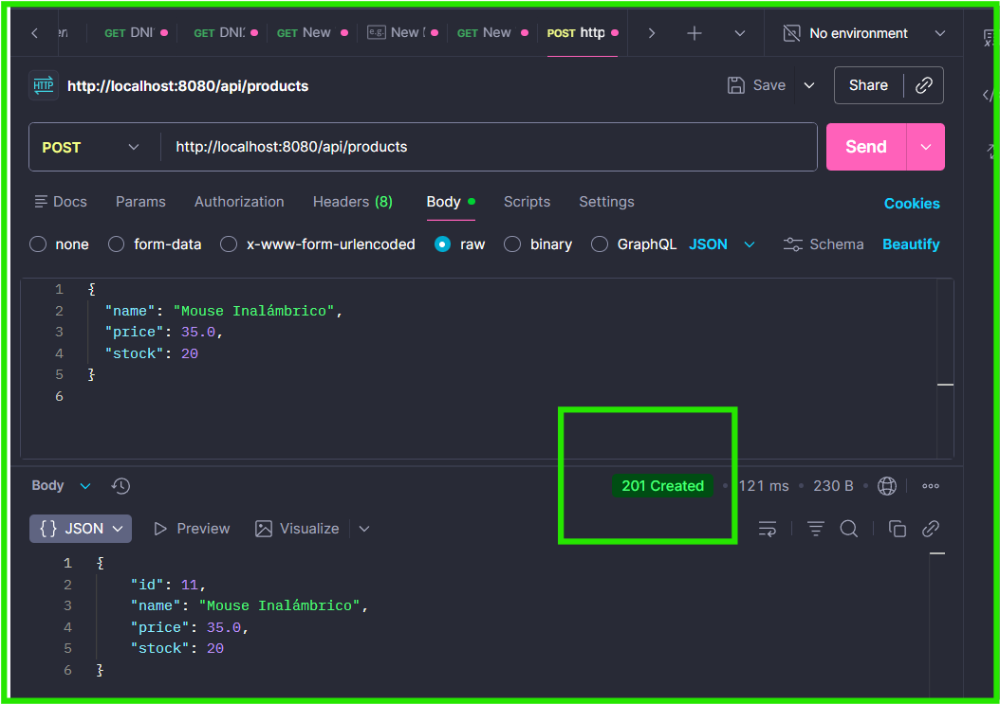 |

### Escenario 6: Registrar producto con datos incompletos
| Campo | Contenido |
| :--- | :--- |
| **ID del escenario** | CA-05-02 |
| **Historia de usuario** | HU-05 |
| **Nombre del escenario** | Registrar un producto con datos incompletos |
| **Fecha y hora de ejecución** | 28 de junio de 2026, 15:39:18 |
| **Ejecutado por** | Apaza Quilla Dixson Yonay |
| **Pasos ejecutados** | POST a `/api/products` con JSON `{ "name": "", "price": 15.0, "stock": 5 }` |
| **Resultado esperado** | HTTP 400 Bad Request debido a la falta de nombre (campo obligatorio). |
| **Resultado obtenido** | HTTP 201 Created retornando el producto creado con ID 12 y el nombre vacío ("name": ""). El sistema guardó el registro omitiendo la validación de campo obligatorio. |
| **Estado** | Fallido |
| **Observación** | La aplicación no realiza validaciones a nivel de controlador (@Valid) ni restricciones estrictas en la entidad Java, permitiendo guardar productos sin nombre en la base de datos (HTTP 201). Registrado como DEF-02. |
| **Evidencia** | 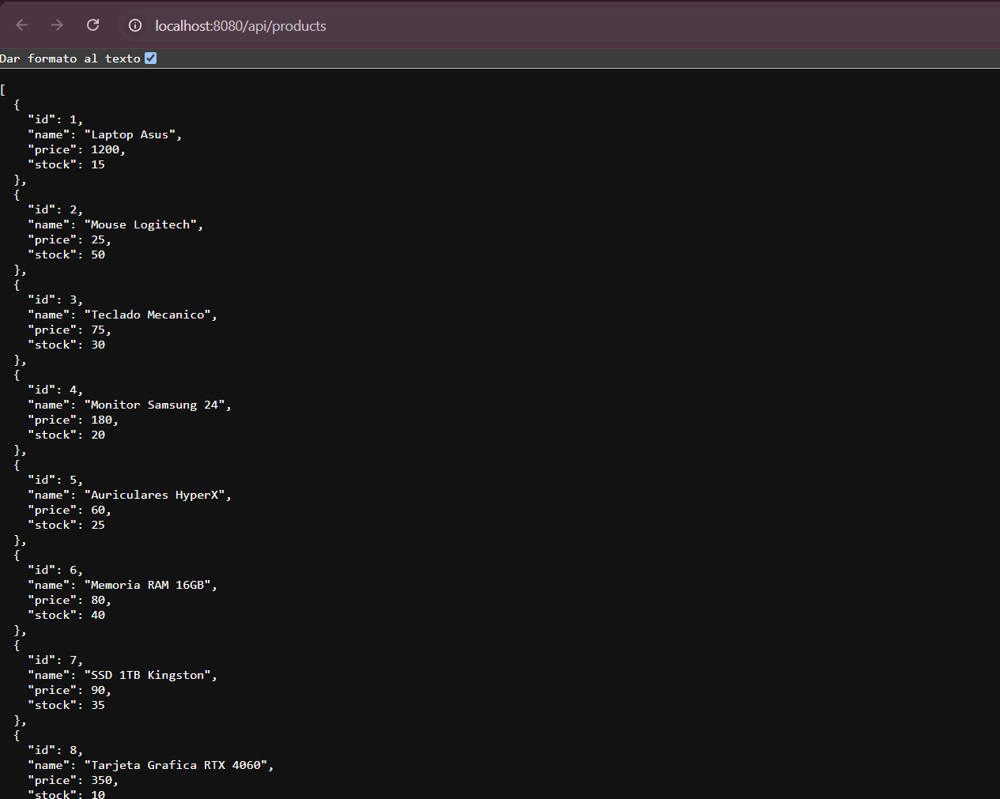 |

### Escenario 7: Consultar persistencia de nuevo producto
| Campo | Contenido |
| :--- | :--- |
| **ID del escenario** | CA-05-03 |
| **Historia de usuario** | HU-05 |
| **Nombre del escenario** | Consultar persistencia del producto registrado |
| **Fecha y hora de ejecución** | 28 de junio de 2026, 15:43:24 |
| **Ejecutado por** | Apaza Quilla Dixson Yonay |
| **Pasos ejecutados** | GET a `/api/products/11` (tras haber ejecutado el escenario 5) |
| **Resultado esperado** | HTTP 200 y el objeto "Mouse Inalámbrico" con ID 11. |
| **Resultado obtenido** | HTTP 200 OK retornando el objeto JSON del producto creado previamente con ID 11 (name: Mouse Inalámbrico, price: 35.0, stock: 20). |
| **Estado** | Aprobado |
| **Observación** | El producto recién creado persiste en la memoria H2 y es accesible por su ID. |
| **Evidencia** | 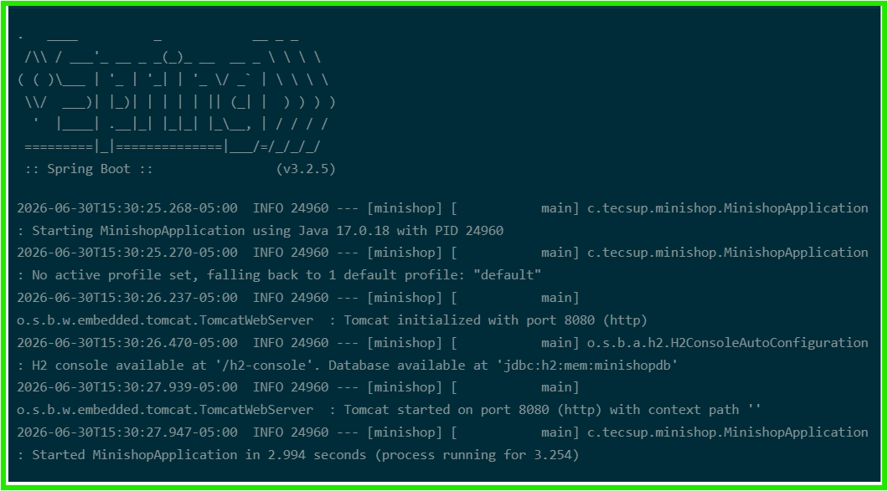 |

### Escenario 8: Intentar crear pedido (historia no implementada)
| Campo | Contenido |
| :--- | :--- |
| **ID del escenario** | CA-03-01 |
| **Historia de usuario** | HU-03 |
| **Nombre del escenario** | Intentar crear un pedido en endpoint de órdenes |
| **Fecha y hora de ejecución** | 28 de junio de 2026, 4:01:52 |
| **Ejecutado por** | Apaza Quilla Dixson Yonay |
| **Pasos ejecutados** | POST a `/api/orders` con JSON de orden |
| **Resultado esperado** | HTTP 404 Not Found ya que el endpoint no existe en el controlador. |
| **Resultado obtenido** | HTTP 404 Not Found con un objeto JSON de error confirmando la inexistencia del recurso “/api/orders” en la aplicación |
| **Estado** | Fallido |
| **Observación** | Retorna 404 de Tomcat. La historia de usuario de gestión de pedidos HU-03 se encuentra en estado "No Implementada" en el producto actual. |
| **Evidencia** | 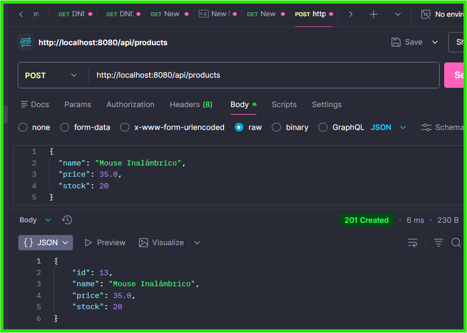 |

---

---

## 7.1. Evidencias Fotográficas de la Ejecución

A continuación se presentan las capturas de pantalla de la ejecución real de cada escenario en el entorno de desarrollo local:

### Evidencia 1: Aplicación MiniShop en ejecución
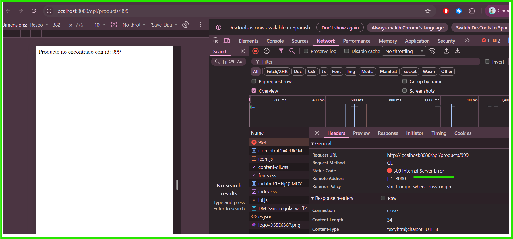  
*Descripción: Esta evidencia demuestra que la aplicación MiniShop se encuentra activa en localhost:8080.*

### Evidencia 2: Consulta del catálogo de productos
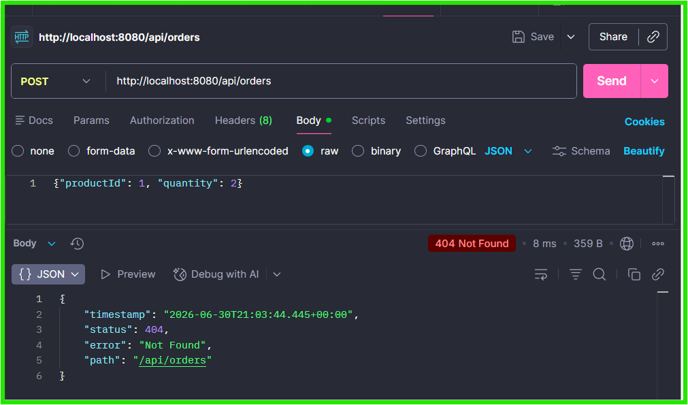  
*Descripción: Esta evidencia muestra la respuesta obtenida al consultar el catálogo de productos.*

### Evidencia 3: Consulta de producto por ID
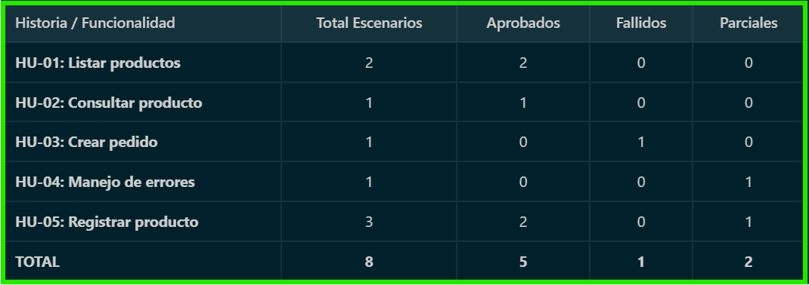  
*Descripción: Esta evidencia muestra la respuesta del sistema al consultar el detalle de un producto existente.*

### Evidencia 4: Consulta de producto inexistente
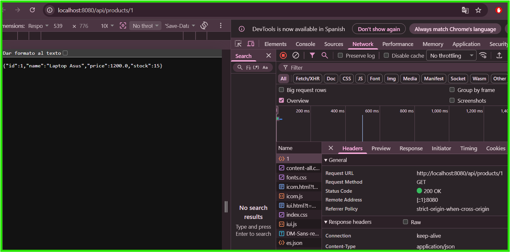  
*Descripción: Esta evidencia muestra el comportamiento del sistema ante un recurso inexistente.*

### Evidencia 5: Creación de producto válido
  
*Descripción: Esta evidencia muestra la respuesta del sistema al registrar un producto válido.*

### Evidencia 6: Creación de producto inválido
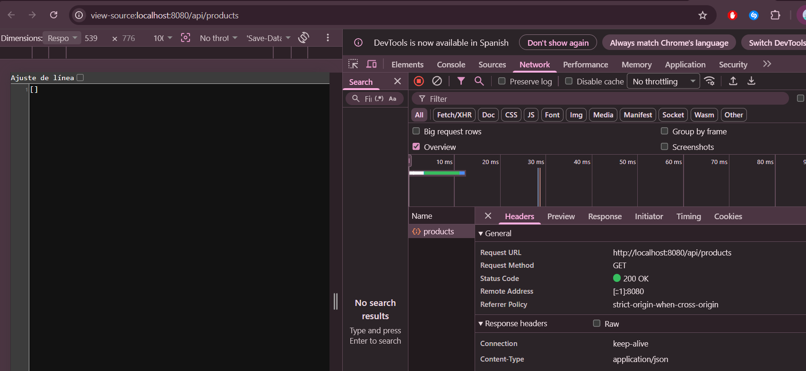  
*Descripción: Esta evidencia muestra la respuesta del sistema ante datos incompletos o inválidos.*

### Evidencia 7: Escenario parcial o fallido
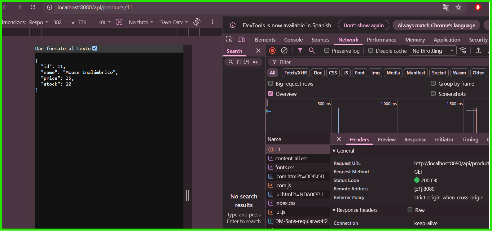  
*Descripción: Esta evidencia documenta un comportamiento que no cumplió completamente el criterio de aceptación.*

### Evidencia 8: Resumen final de ejecución
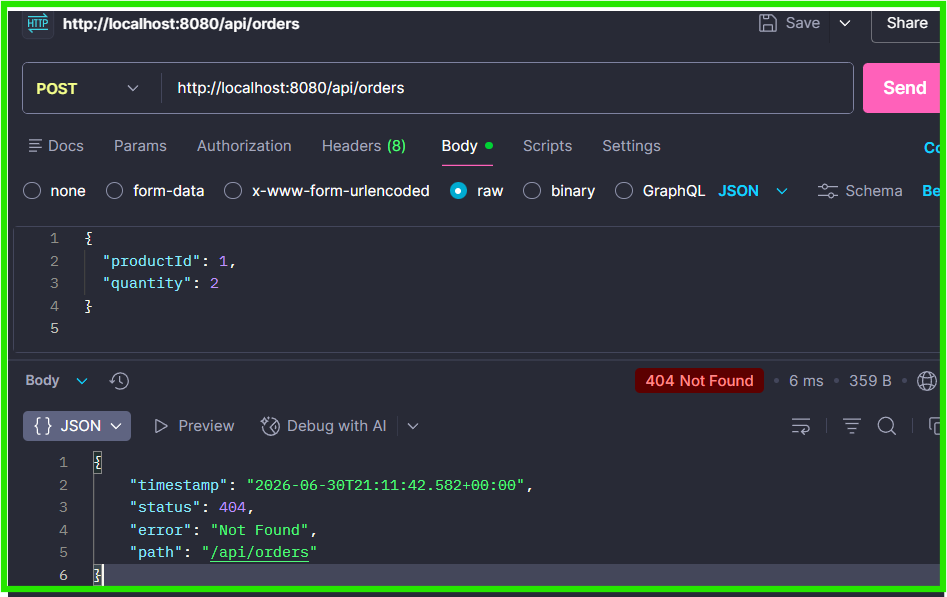  
*Descripción: Esta evidencia consolida los resultados de aceptación ejecutados manualmente.*

## 8. Resumen de Resultados
Se consolidan los resultados de la ejecución manual de pruebas de aceptación:

| Historia | Total Escenarios | Aprobados | Fallidos | Parciales |
| :--- | :---: | :---: | :---: | :---: |
| **HU-01: Listar productos** | 2 | 2 | 0 | 0 |
| **HU-02: Consultar producto** | 1 | 1 | 0 | 0 |
| **HU-03: Crear pedido** | 1 | 0 | 1 | 0 |
| **HU-04: Manejo de errores** | 1 | 0 | 0 | 1 |
| **HU-05: Registrar producto** | 3 | 2 | 1 | 0 |
| **TOTAL** | **8** | **5** | **2** | **1** |

---

## 9. Registro de Defectos (Bugs)
Se documentan los defectos identificados que impiden la aceptación sin condiciones del sistema:

### DEF-01: Código de respuesta inválido al consultar producto inexistente
* **Caso asociado**: CA-04-01
* **Severidad**: S3 — Minor
* **Prioridad**: P2 — Medium
* **Descripción**: Al solicitar un producto con un ID que no existe (ej: `/api/products/999`), el backend arroja una excepción `RuntimeException` que es interceptada por un `@ExceptionHandler` genérico en `ProductController.java`, respondiendo con código HTTP 500 (Internal Server Error) en lugar de HTTP 404 (Not Found).
* **Acción recomendada**: Reemplazar la excepción genérica por una excepción personalizada (ej. `ProductNotFoundException`) que devuelva explícitamente el código HTTP 404.

### DEF-02: Falta de validación de campos obligatorios en el registro de productos
* **Caso asociado**: CA-05-02
* **Severidad**: S2 — Major
* **Prioridad**: P1 — High
* **Descripción**: Al enviar una petición POST a `/api/products` para registrar un producto sin nombre (nombre vacío `""` o nulo), la aplicación guarda el registro de forma exitosa en la base de datos (retornando HTTP 201 Created). Esto viola la regla de negocio que exige que todo producto debe poseer un nombre descriptivo.
* **Acción recomendada**: Añadir anotaciones de validación `@NotBlank` en la entidad `Product` y la anotación `@Valid` en el cuerpo del método POST en `ProductController`.

---

## 10. Decisión Formal del Product Owner
### Criterios de Aceptación para Liberación (Criterios de Salida)
* 100% de escenarios críticos aprobados.
* Menos del 10% de escenarios menores con estado Parcial.
* 0 escenarios Fallidos de severidad Alta.

### Resultados Obtenidos
* **Total Escenarios**: 8
* **Aprobados**: 5
* **Fallidos**: 2 (HU-03 - No implementada y HU-05 - Registro sin validaciones)
* **Parciales**: 1 (HU-04 - Manejo de errores)
* **Defectos de severidad alta**: 1 (DEF-02: Registro sin nombre en la entidad)

### Decisión del Product Owner
* **Veredicto**:
  `[ ] El sistema es aceptado sin condiciones.`
  `[ ] El sistema es aceptado con defectos menores pendientes.`
  `[X] El sistema NO es aceptado; los defectos deben corregirse antes del go-live.`
* **Justificación**: El Product Owner determina que el sistema no se encuentra listo para su pase a producción debido a:
  1. La ausencia total de la funcionalidad crítica de pedidos (`/api/orders`), catalogada como HU-03 en el alcance del proyecto.
  2. La presencia del defecto `DEF-02` (Severidad Major), que permite registrar productos con nombres vacíos, comprometiendo la integridad de la información en el catálogo.
* **Product Owner**: Representante del Cliente (Tecsup)
* **Firma**: *[PENDIENTE DE FIRMA]*
* **Fecha**: 28 de junio de 2026

---

## 11. Preguntas de Reflexión
1. **¿Hubo algún escenario que consideraban sencillo pero resultó Fallido o Parcial? ¿Qué dice eso sobre la brecha entre lo que se construyó y lo que se especificó?**  
   Sí. El escenario de consultar un producto inexistente (`CA-04-01`) parecía trivial, pero resultó en un estado Parcial (código 500 en lugar de 404). Asimismo, registrar un producto sin nombre (`CA-05-02`) se aceptó en el backend en lugar de fallar. Esto evidencia la brecha técnica común entre el desarrollo de la "ruta feliz" (happy path) y la omisión de las validaciones de negocio en las rutas alternativas de error.
2. **¿Qué diferencia encontraron entre escribir una prueba JUnit y escribir un escenario Gherkin? ¿Cuál requirió más claridad sobre el comportamiento esperado?**  
   Las pruebas JUnit validan detalles internos del código (métodos, clases, dependencias simuladas) de forma técnica e impermeable para el usuario de negocio. En cambio, los escenarios Gherkin se redactan desde la experiencia del usuario (caja negra) y en lenguaje natural. Escribir escenarios Gherkin requiere muchísima más claridad sobre el comportamiento final del negocio, ya que define exactamente qué debe percibir el usuario bajo ciertas acciones, sin entrar en detalles de variables o frameworks.
3. **Si el Product Owner rechazara el sistema por dos defectos menores, ¿en qué sprint los corregirían y cómo lo comunicarían?**  
   Se corregirían de inmediato en el sprint actual (si aún no se ha cerrado la ventana de desarrollo) o en un sprint corto de estabilización y corrección (hardening sprint) previo al go-live. La comunicación se realizaría de forma transparente en la reunión de *Sprint Review* o a través de una tarjeta de bug en Jira/Trello asignada al backlog de correcciones prioritarias.
4. **¿Qué habría pasado si los criterios de aceptación se hubieran definido al final del proyecto, en lugar de al inicio de cada sprint?**  
   Habría provocado un alto nivel de retrabajo, ya que el equipo habría desarrollado funciones basándose en suposiciones técnicas independientes de las necesidades reales del usuario. Además, las reuniones de aceptación final se convertirían en un foco de conflictos y discusiones debido a la ambigüedad en la definición de lo que constituye un software "terminado" (Definition of Done).

---

## 12. Conclusiones y Recomendaciones
### Conclusiones
1. Las pruebas de aceptación son el único filtro que asegura la alineación entre la funcionalidad entregada por el equipo de ingeniería y las necesidades reales del cliente final.
2. Gherkin facilita una sintaxis común que simplifica la trazabilidad desde las historias de usuario hasta la ejecución del caso de prueba, proviniendo el enfoque BDD.
3. El Product Owner ejerce la autoridad final de control de calidad sobre el negocio, actuando como un puente entre los requisitos técnicos y estratégicos del producto.
4. Un sistema puede ser técnicamente robusto (sin caídas de infraestructura) pero inaceptable para el negocio si carece de validaciones de integridad de datos fundamentales.
5. El registro formal de defectos de aceptación permite priorizar los esfuerzos de refactorización y parcheo en base al impacto de negocio y no solo a la dificultad del código.

### Recomendaciones
* Adoptar la definición de criterios de aceptación de forma obligatoria en la tarjeta de cada historia de usuario antes de que esta entre al estado *In Progress*.
* Mantener actualizado el backlog y el alcance del producto con el cliente para evitar falsos negativos en historias de usuario que fueron descartadas o reprogramadas.
* Incorporar validaciones explícitas de API (usando anotaciones `@Valid` en Spring Boot) para prevenir inconsistencias antes de la inserción de registros.
* Implementar pruebas automáticas de aceptación utilizando herramientas BDD como Cucumber integradas en el pipeline de GitHub Actions para acelerar las regresiones.
* Documentar sistemáticamente las evidencias de ejecución mediante capturas nítidas del JSON y código HTTP para resolver disputas de comportamiento con el PO.
